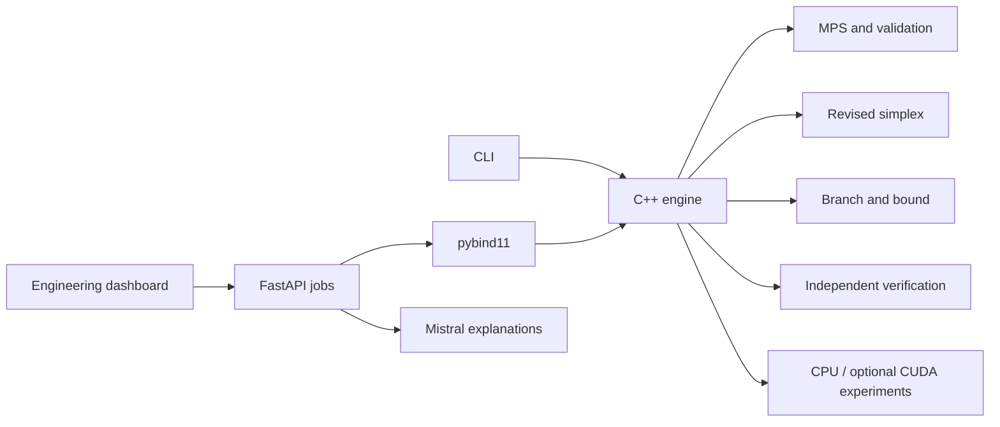

# AstraNiti — Sovereign Optimizer

> **Astra** for a precision instrument; **Niti** for disciplined strategy.
> A from-scratch optimization laboratory built for transparent, sovereign computation.

[](https://isocpp.org/)
[](#verification)
[](#verification)
[](#trust-boundary)
[](https://render.com/deploy?repo=https%3A%2F%2Fgithub.com%2Fnischala755%2Fsovopt)

An independent C++20 mathematical optimization engine with sparse model import,
presolve, two-phase revised simplex, a convex-QP primal-dual interior-point method,
independently checked numerical results, and deterministic MILP branch-and-bound.
It does not wrap an existing solver.

<details>
<summary><strong>Why this matters for the hackathon</strong></summary>

Most optimization applications delegate their mathematical decisions to an
opaque third-party engine. AstraNiti implements its LP and MILP path directly,
checks terminal claims against the original model, exposes live evidence through
an API and dashboard, and keeps optional AI outside the mathematical trust path.

</details>

## Live workflow


## Capability status

| Goal | Evidence | Status |
|---|---|---|
| Robust LP/MILP engine | Revised simplex, branch-and-bound, certificates and regression tests | Implemented |
| Convex QP and interior point | Infeasible-start predictor-corrector method with independent primal/KKT residual checks | Implemented for small convex models |
| CLI and application API | Native CLI, pybind11 and asynchronous FastAPI jobs | Implemented |
| Engineering dashboard | Model inspection, telemetry, verification and experiment views | Implemented |
| Recognised benchmarks | Netlib AFIRO, SC50A and SC50B match published optima and pass independent verification | Demonstrated |
| Broad Netlib/MIPLIB coverage | MIPLIB flugpl currently reaches the iteration limit | In progress |
| Established-solver performance comparison | Isolated HiGHS 1.15.1 comparison for three Netlib LPs and MIPLIB flugpl | Demonstrated |
| Optimization Flight Recorder | Real solve timeline, certificate, SHA-256 integrity, replay and independent re-verification | Implemented |
| Challenging large-scale robustness | Current sparse refactorization architecture is not yet an industrial-scale performance result | In progress |
| GPU acceleration | Real optional CUDA kernels exist; no CUDA hardware/toolkit was available for measurement | Unverified |

The status table is intentionally evidence-based. See
[benchmark evidence](docs/benchmark_results.md) before making performance claims.

The continuous LP interior-point path is available explicitly:

```sh
sovereign solve model.mps --method interior_point
```

The C++ `QuadraticModel` API accepts a symmetric positive-semidefinite sparse
Hessian and returns original-coordinate bound multipliers only after independent
primal, stationarity, complementarity, and objective verification.
Its Newton system is presently assembled densely, so this capability is a
correctness foundation for small convex QPs rather than a large-scale claim.

To validate CUDA on an NVIDIA Windows machine and retain reproducible evidence:

```powershell
powershell -NoProfile -ExecutionPolicy Bypass -File scripts/cuda-validate.ps1
```

The validation pack performs CPU/GPU numerical cross-checks and records static
CPU, static GPU, and adaptive measurements. See
[GPU architecture and validation](docs/gpu_architecture.md).

## Build and test on Windows

From the repository root, with Visual Studio C++ desktop Build Tools and its
CMake component installed:

```powershell
powershell -NoProfile -ExecutionPolicy Bypass -File scripts/build.ps1
powershell -NoProfile -ExecutionPolicy Bypass -File scripts/build.ps1 -Configuration Release
```

The helper discovers Visual Studio through `vswhere`, selects MSVC x64, locates
the bundled CMake, configures, builds and runs CTest. `ExecutionPolicy Bypass`
applies only to that process; it does not change machine or user policy. The
script does not modify PATH, install software or require administrator access.
Run it from the repository root. Build output is under `build/msvc`.

The tested machine has Visual Studio Build Tools 2026, MSVC 19.51.36248, Windows
SDK 10.0.26100.0 and bundled CMake 4.3.1-msvc1. The helper also recognizes Visual
Studio 2022; that toolchain has not been tested here.

Catch2 v3.8.1 is fetched from its official Git repository only when
`BUILD_TESTING=ON` (the default). The first configure needs Git and network access.
Its resolved revision on this build is `2b60af89e23d28eefc081bc930831ee9d45ea58b`.
It is a test dependency, never linked into the CLI or production libraries.
No optimization engine is downloaded, linked or invoked.

With CMake on PATH and another C++20 toolchain, standard CMake commands are:

```sh
cmake -S . -B build/default -DCMAKE_BUILD_TYPE=Debug
cmake --build build/default --parallel
ctest --test-dir build/default --output-on-failure
```

The base project requires CMake 3.25 or newer; use a CMake release that supports
your selected Visual Studio generator. For a network-free production build,
configure with `-DBUILD_TESTING=OFF`. For offline tests, provide an existing
Catch2 3.8.1 source tree with `-DFETCHCONTENT_SOURCE_DIR_CATCH2=/path/to/Catch2`.

## CLI

```powershell
build/msvc/Debug/sovereign.exe --help
build/msvc/Debug/sovereign.exe inspect examples/small_lp.mps
build/msvc/Debug/sovereign.exe inspect examples/mixed.mps --json
build/msvc/Debug/sovereign.exe inspect examples/ranges.mps --config examples/inspect.yaml
build/msvc/Debug/sovereign.exe validate examples/small_lp.mps --json
build/msvc/Debug/sovereign.exe solve examples/small_lp.mps --json
build/msvc/Debug/sovereign.exe solve examples/mixed.mps --branching pseudocost
build/msvc/Debug/sovereign.exe solve examples/small_lp.mps --record run.astra
build/msvc/Debug/sovereign.exe replay run.astra --reverify
```

Use `--mps-format fixed` for traditional fixed fields and blank name
continuations. Default `free` mode accepts whitespace-separated records,
including conventionally aligned files with explicit names on each record.
Format flags override configuration. See [MPS dialect](docs/mps.md).

`inspect` prints actual model counts, density, objective metadata, row classes and
absolute matrix coefficient extrema. `validate` reports structural validity.
`solve` selects LP or MILP from the declared variable domains and returns only
terminal claims that pass independent original-model verification.
Logs are JSON lines on stderr; `--json` produces a single JSON document on stdout.
Exit codes distinguish success, input/configuration errors, numerical failure,
and resource limits; run `sovereign --help` for the current mapping.

### Optimization Flight Recorder

`--record` captures the original MPS, model fingerprint, normalized solver
configuration, presolve state, numerical telemetry, event timeline, solution,
certificate and verification report. `checksums.json` covers every artifact with
SHA-256. Replay validates integrity before reading mathematical results;
`--reverify` invokes the independent original-model verifier again. The REST API
can create, replay and download bundles, and the dashboard renders the recorded
timeline and integrity state from those API responses.

### Example statistics

These counts are independently specified in executable integration tests, then
checked against the CLI's parsed JSON output:

| File | Variables | Constraints | Matrix nonzeros | Integer, including binary | Binary |
|---|---:|---:|---:|---:|---:|
| `small_lp.mps` | 2 | 2 | 4 | 0 | 0 |
| `mixed.mps` | 3 | 2 | 5 | 2 | 1 |
| `ranges.mps` | 2 | 3 | 4 | 0 | 0 |

Objective coefficients are not counted as matrix nonzeros. The ranges example
has two ranged rows, one equality and objective offset 5.

## Configuration

```yaml
log_level: info
mps_format: free
max_line_length: 1048576
max_entries: 10000000
```

This is deliberately a **flat, unquoted YAML scalar subset**, not a general YAML
parser. Blank lines and `#` comments
are accepted. Nested mappings, sequences, quoted values, unknown/duplicate keys,
zero/negative limits and malformed values are rejected. Logging levels are
`trace`, `debug`, `info`, `warn`, `error`. Limits count bytes per MPS line and
input COLUMNS coefficient pairs (including objective entries), respectively.
See [configuration and logging](docs/configuration.md).

## Architecture and C++ interface



`sovereign::core` contains the sparse model, presolve, basis, LP/MILP algorithms,
verification, fingerprints, generators, and execution backends. `sovereign_app`
adds configuration, logging and CLI dispatch. The Python extension exposes the
same native engine to the FastAPI service. Mistral receives only allowlisted
aggregate metadata and cannot alter or certify a solver result.

```cpp
#include <sovereign/mps.hpp>
#include <sovereign/validation.hpp>

auto model = sovereign::read_mps_file("examples/small_lp.mps");
auto stats = sovereign::statistics(model);
auto report = sovereign::validate(model);
```

Models may also be assembled from `Variable`, `Constraint`, objective vectors and
`CscMatrix::from_triplets`. Call `require_valid` after programmatic edits.

## Python service and dashboard

```powershell
python -m venv .venv
.venv\Scripts\Activate.ps1
python -m pip install --upgrade pip
python -m pip install -e ".[test]"
pytest -q tests/python
sovereign-api
```

In another terminal, run the dashboard:

```powershell
cd web
npm ci
npm test
npm run build
npm run dev
```

The Vite development server proxies `/api` to `127.0.0.1:8000`. In production,
serve the built assets behind a reverse proxy that sends `/api` to FastAPI, or
set `VITE_API_BASE_URL` while building.

Copy `.env.example` to `.env` and set `MISTRAL_API_KEY` only if advisory AI
features are wanted. Solver, verification, and benchmark endpoints work without
AI. See [API setup](docs/api.md) and [AI boundary](docs/ai_assistant.md).

## Verification

Catch2 tests cover the native components, with CTest also executing the CLI and
parsing its JSON. Pytest covers API behavior and a real native solve. Vitest and
TypeScript checks cover the dashboard.

- Verification uses independent residual and certificate checks in double
  precision; it is not an exact-rational proof system.
- The revised-simplex basis currently refactorizes sparse LU after each pivot.
  This favors clarity and reliability over large-instance performance.
- MPS support is intentionally restricted; unsupported extensions fail explicitly.
- Import builds a triplet buffer before CSC conversion. It is not an out-of-core
  importer, and the limits do not form a complete hostile-input memory budget.
- Windows CLI paths currently use narrow arguments. Prefer ASCII paths; error
  JSON for non-ASCII paths is not guaranteed to use UTF-8 on every Windows locale.
- CUDA is optional (`-DSOVEREIGN_ENABLE_CUDA=ON`). Real CSC CUDA kernels are
  present, but this machine has only Intel UHD graphics and no CUDA toolkit, so
  their compilation and runtime behavior have not been validated here.
- GPU execution requires a compatible CUDA build and device; unavailable modes
  must report that state. No GPU performance claim is made without measurements.

See [architecture](docs/architecture.md), [mathematical algorithms](docs/algorithms.md),
[MILP](docs/milp.md), [GPU architecture](docs/gpu_architecture.md), and
[benchmark methodology](docs/benchmark_methodology.md).

## Trust boundary

- No external optimization engine is linked, invoked, or hidden behind the API.
- Mistral never solves, verifies, changes, or authorizes a mathematical result.
- AI explanations receive allowlisted aggregate metadata only.
- AI formulations require explicit confirmation and native validation.
- API credentials come from environment variables and `.env` is ignored.

## Hackathon demo script

1. Upload `examples/small_lp.mps` in the dashboard.
2. Inspect its dimensions and deterministic fingerprint.
3. Solve it and watch LP telemetry.
4. Open Verification and inspect the independent certificate report.
5. Repeat with `examples/mixed.mps` to demonstrate MILP branching.
6. Run CPU/GPU/adaptive experiments; unavailable hardware is reported without invented metrics.
7. Enable Mistral only for the final explanatory layer.
